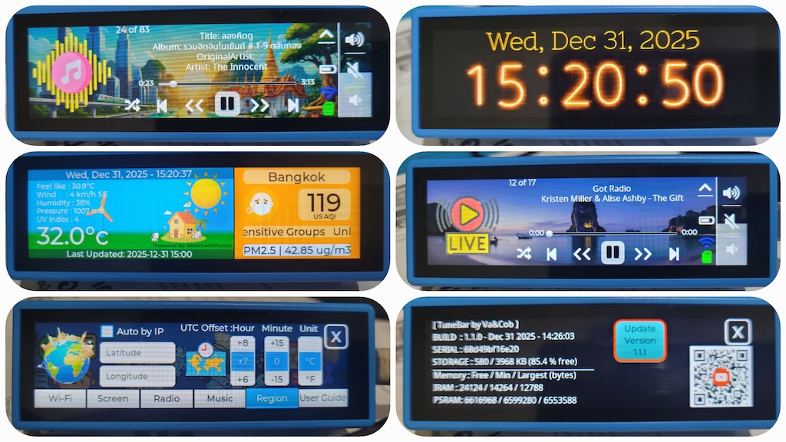

# 🎧🕺💃👯💫[ TuneBar ] by Va&Cob 💫👯🕺💃🎧

TuneBar is a feature-rich media player powered by the ESP32-S3 microcontroller. It combines high-quality audio playback with a modern, touch-screen interface to deliver a complete desktop companion experience.

[How to play TuneBar](https://www.youtube.com/...)



## 🧘 No Code, No Headache

Is your idea of a "good time" *not* debugging C++? Just want the shiny gadget to work?
We did the nerd stuff so you don't have to.
[**Flash it here and pretend you coded it**](https://vaandcob.github.io/webpage/src/index.html)

## Features

*   **Internet Radio**: Stream online radio stations via WiFi.
*   **Hi-Res Audio Player**: Supports playback of MP3, FLAC, and AAC audio formats.
*   **Weather Station**: Location-based real-time weather condition display, updated every 15 minutes.
*   **Air Quality Display**: Location-based air quality monitoring, updated every 15 minutes.
*   **Digital Clock**: Precise timekeeping and display (Note: Time resets on power loss due to hardware design).

*   **Interactive UI**: A smooth, responsive graphical user interface built with [LVGL](https://lvgl.io/), designed using SquareLine Studio.
*   **Torch**: Built-in light functionality.
*   **OTA Firmware Update**: Wireless firmware updates.
*   **AI Voice Chat**: Planned feature for a future update.🚧 (not yet implemented)


## 💻 Hardware Specifications

*   **Board**: Waveshare ESP32-S3-Touch-LCD-3.49
*   **Microcontroller**: ESP32-S3R8 (Dual-core Xtensa® 32-bit LX7, 240MHz)
*   **Memory**: 16MB Flash, 8MB PSRAM
*   **Display**: 3.49-inch Capacitive Touch Screen
*   **Audio**: ES8311 Codec (I2S)
*   **Connectivity**: 2.4GHz Wi-Fi & Bluetooth 5 (LE)

## 🛒 Where to Buy

*   [AliExpress](https://s.click.aliexpress.com/e/_c3ML7dDr)

## ℹ️ Resources

*   [Waveshare Wiki](http://www.waveshare.com/wiki/ESP32-S3-Touch-LCD-3.49)

## 📻 Radio Stations (SD Card)

To manage your radio station list, you can create a `station.csv` file and upload it via the SD card.
An example `station.csv` is available in the `/sketch/data` folder.
To upload, go to the **Config -> Radio** tab and click **UPLOAD**.

### CSV Format
The file should contain one station per line in the format: `Station Name,URL`.
**Note:** Only `http` URLs are supported; `https` is not allowed.

**Example `station.csv`:**
```csv
BBC Radio 1,http://stream.live.vc.bbcmedia.co.uk/bbc_radio_one
Smooth Chill,http://media-the.musicradio.com/SmoothChillMP3
```

### How to Upload
1.  Create the `station.csv` file on your computer.
2.  Copy the file to the root directory of a FAT32 formatted microSD card.
3.  Insert the SD card into the TuneBar device.
4.  Restart the device to load the stations.

## 🎶 Media Player Support

TuneBar supports playback of MP3, AAC, FLAC, and WAV files, utilizing the [ESP32-audioI2S](https://github.com/schreibfaul1/ESP32-audioI2S) library.

To use this feature, copy your media files to the SD card. The system supports folder structures up to 5 levels deep.
Go to the **Config -> Music** tab, then click **LOAD** to index the music files.

## License

This project is licensed under the [Creative Commons Attribution-NonCommercial-ShareAlike 4.0 International (CC BY-NC-SA 4.0)](https://creativecommons.org/licenses/by-nc-sa/4.0/) license.
You are free to use, modify, and distribute this software for **non-commercial purposes only**.

This project uses open-source libraries. Please refer to the specific license files for LVGL, ArduinoJson, and the ES8311 driver.