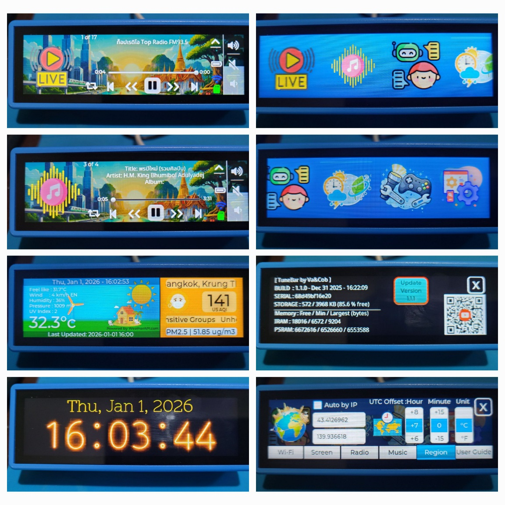

# 🎧🕺💃👯💫[ TuneBar ]💫👯🕺💃🎧


**TuneBar** is a custom-engineered, palm-sized media bar powered by the ESP32-S3. Its compact, stick-like design allows it to sit on your table or travel with you anywhere. Developed with a focus on original software design, it features a unique, self-designed UI/UX and custom code implementations tailored for performance.

This project integrates a versatile music player and internet radio with practical daily utilities—including real-time weather, air quality monitoring, and a digital clock—offering a functional and aesthetically unique experience whether stationary or on the go.




## [🎬 Youtube](https://www.youtube.com/@vaandcob) Recommend watch the YouTube video for usage instructions.

## ✅ Features

*   **Internet Radio**: Stream online radio stations via WiFi.
*   **Audio Player**: Supports playback of MP3, FLAC, and AAC audio formats.
*   **Weather Station**: Location-based real-time weather condition display, updated every 15 minutes.
*   **Air Quality Display**: Location-based air quality monitoring, updated every 15 minutes.
*   **Digital Clock**: Precise timekeeping and display (Note: Time resets on power loss due to hardware design).

*   **Interactive UI**: A smooth, responsive graphical user interface built with [LVGL](https://lvgl.io/), designed using SquareLine Studio.
*   **Torch**: Built-in light functionality.
*   **OTA Firmware Update**: Wireless firmware updates.
*   **Planned feature for a future update.🚧 (not yet implemented)**
    - AI Voice Chat
    - Games


## 💻 Hardware Specifications

*   **Board**: Waveshare ESP32-S3-Touch-LCD-3.49
*   **Microcontroller**: ESP32-S3R8 (Dual-core Xtensa® 32-bit LX7, 240MHz)
*   **Memory**: 16MB Flash, 8MB PSRAM
*   **Display**: 3.49-inch Capacitive Touch Screen
*   **Audio**: ES8311 Codec (I2S)
*   **Connectivity**: 2.4GHz Wi-Fi & Bluetooth 5 (LE)
*   Core audio functionality is powered by the [ESP32-audioI2S](https://github.com/schreibfaul1/ESP32-audioI2S) library.
*   IDE: VSCode + pioarduino IDE extension

## 🛒 Where to Buy (affiliate) [AliExpress](https://s.click.aliexpress.com/e/_c3F0TxcJ)

## ℹ️ Resources [Waveshare Wiki](http://www.waveshare.com/wiki/ESP32-S3-Touch-LCD-3.49)

## 💾 Customizing Radio & Music (SD Card)

### 📻 Radio Stations

To manage your radio station list, you can create a `station.csv` file and upload it via the SD card.

An example `station.csv` is available in the `/sketch/data` folder.

### CSV Format
The file should contain one station per line in the format: `Station Name,URL`.
**Note:** Only `http` URLs are supported; `https` is not allowed.

**Example `station.csv`:**
```csv
BBC Radio 1,http://stream.live.vc.bbcmedia.co.uk/bbc_radio_one
Smooth Chill,http://media-the.musicradio.com/SmoothChillMP3
```

### How to Upload
1.  Create or Edit the `station.csv` file on your computer.
2.  Copy the file to the root directory of a FAT32 formatted microSD card.
3.  Insert the SD card into the TuneBar device.
4.  To upload, go to the **Config -> Radio** tab and click **UPLOAD**.

### 🎶 Media Player Support

TuneBar supports playback of MP3, AAC, FLAC, and WAV files.

To use this feature, copy your media files to the SD card. The system supports folder structures up to 5 levels deep.
Go to the **Config -> Music** tab, then click **LOAD** to index the music files.

## 🧘 Quick start, flash and go, no code needed

Is your idea of a "good time" *not* debugging C++? Just want the shiny gadget to work?
We did the nerd stuff so you don't have to.

- [Flash TuneBar here](https://vaandcob.github.io/webpage/src/index.html)

## License

This project is licensed under the [Creative Commons Attribution-NonCommercial-ShareAlike 4.0 International (CC BY-NC-SA 4.0)](https://creativecommons.org/licenses/by-nc-sa/4.0/) license.
You are free to use, modify, and distribute this software for **non-commercial purposes only**.

This project uses open-source libraries. Please refer to the specific license files for LVGL, ArduinoJson, and the ES8311 driver.

-----
[](https://www.buymeacoffee.com/vaandcob)